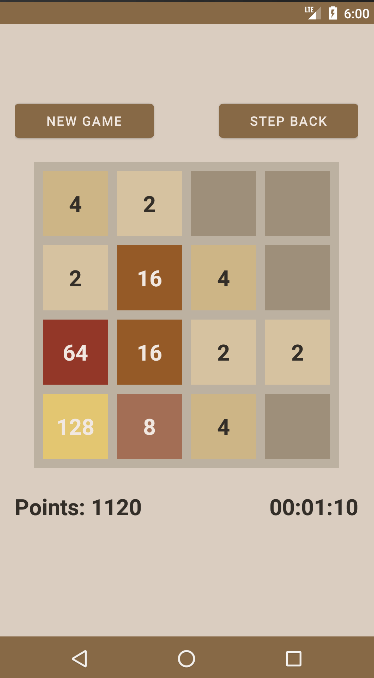

# **2048**

A projekt a jól ismert 2048 játék implementációja
- **Android**-ra
- **Kotlin** nyelven

Egy egyszerű játék, melynek célja a csempék(tile) összeadásával eljutni egy 2048 értékűig. Ha ez sikerült, akkor nyert a játékos. Veszíteni úgy lehet, hogy még idő előtt tele lesz a pálya és nem tudunk összeadni.
Vezérelni az ujjunk csúsztatásával lehet, 4 irányba.

A program számon tartja az új kör kezdete óta eltelt időt, és szerzett pontokat, amit felvisz egy ranglistába is. Ezt egy relációs adatbázisba írja ki, **RoomDatabase** segítségével. A játék állását simán **SharedReferences**-ben tárolja.

:bulb: Játék célja:
- szórakoztatás és időtöltés, amikor az embernek van egy szabad 10-15 perce.

## :joystick: Játék kinézete

