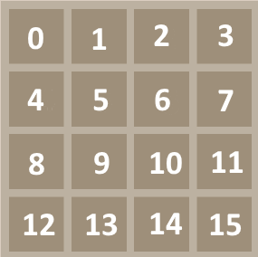

# :sparkler: UI Tesztek

Androidon a teszteket két nagy kategóriára tudjuk bontani:
- **Local tests**: Ezek, olyan tesztek, melyekhez nem szükséges Android eszköz, mert a fejlesztő eszközén vagy CI rendszeren is tudnak futni. Általában az egységtesztek tartoznak ebbe a kategóriába.
- **Instrumented tests**: Ezek olyan tesztek, melyekhez szükség van fizikai vagy virtuális Android eszközre. A tesztek az Android eszközön futnak. A UI tesztek ide tartoznak.

Ebben a feladatban a UI teszteket készítettem el és dokumentáltam le. A tesztek futtatása előtt néhány beállításra szükség van az eszközön. 

## :exclamation: Előkövetelmények:

0. :iphone: Fizikai Android eszköz vagy Emulátor
1. :computer: Developer mód bekapcsolása
2. :boom: Animációk kikapcsolása:
    - Window animation scale :arrow_right: **Animation off**
    - Transition animation scale :arrow_right: **Animation off**
    - Animator duration scale :arrow_right: **Animation off**

## :point_down: Tesztek végrehajtása:
```bash
./gradlew connectedAndroidTest
```

## :round_pushpin: Navigációval kapcsolatos teszt esetek:

| Teszt eset neve | Leírás | Várt eredmény | :+1: / :-1: |
|:---------------:|:------:|:-------------:|:-----------:|
| appLoadsProperly | Alkalmazás indítása | Középen megjelenik a **2048** felirat. Megjelennek alatta a **PLAY GAME** és **LEADERBOARD** gombok| :+1: |
| navigationToLeaderboard | Átlépés a ranglista képernyőre | Megnyílik a **LeaderboardActivity** | :+1: | 
| navigationToGame | Átlépés a játékba | Megnyílik a **GameActivity** és elindul a játék | :+1: |
| navigationToLeaderboardThenBack | Átlép a rangilsta képernyőre, majd vissza | Megnyílik a **LeaderboardActivity**, majd bezárja és visszalép az eredeti Activity-be | :+1: |
| navigationToGameThenBack | Átlép a játék képernyőre, majd vissza | Megnyílik a **GameActivity** és elindul a játék, majd bezárja és visszalép az eredeti Activity-be | :+1: |

## :video_game: Játéklogikával kapcsolatos teszt esetek:

| Teszt eset neve | Leírás | Várt eredmény | :+1: / :-1: |
|:---------------:|:------:|:-------------:|:-----------:|
| loadTest | Játék betöltődés, és indítás | Közvetlenül a **GameActivity** indítása. Megjelennek a gombok, a játéktér és a feliratok a megfelelő helyen | :+1: |
| tileWithValue2SpawnsInTheFirstPosition | Tile megjelenik a bal felső sarokban | Egy darab csempe jelenik meg a bal felső helyen (0. index) **2*-es felirattal | :+1: |

## :information_source: Előkészületek, változtatások

A tesztek elkészítése előtt publikussá kellett tennem, több függvényt, mert anélkül nem vagy csak nagyon nehezen tudtam volna létrehozni több fontos speciális esetet. 

Szükség volt a program determinisztikussá tételére is. Ezt úgy értem el, hogy felvettem a **GameBoard** osztályba egy flag-et, melyet a UI tesztelés során állítok be. A flag értékét random számítások esetén veszem figyelembe. UI tesztelés módban a játék mindig a legkisebb szabad indexű helyre próbálja létrehozni az új csempét. 



A csempe értéke eredeti játék során **2** vagy **4** lehet véletlenszerűen, tesztelés módban ezt fix **2**-re állítottam. Ez a kényszer nem csökkenti a tesztek hasznosságát, épp ellenkezőleg egyszerűbben lehet elkészíteni és kipróbálni speciális eseteket.


