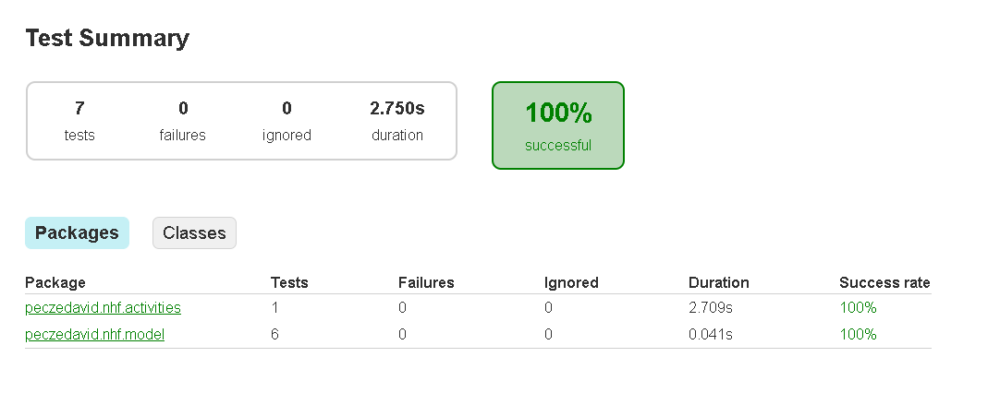
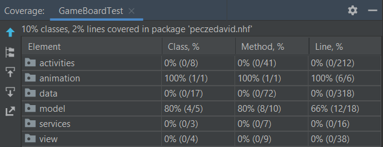
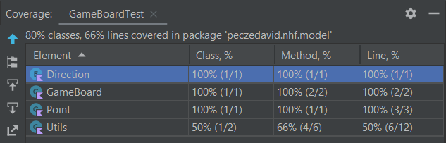
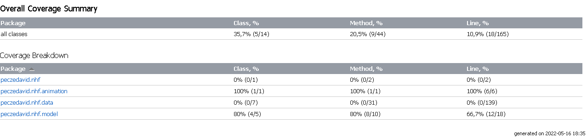
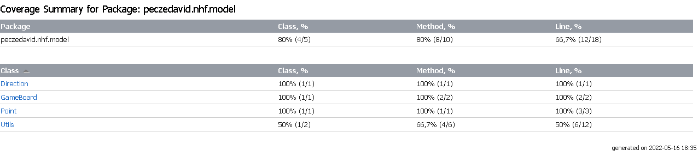

# Unit-tesztek

A unit-teszteket Android Studioban végeztük az IDE beépített tesztelési lehetőségeivel, és könyvtáraival (pl. JUnit).

## Az adatbázissal kapcsolatos teszteset

| Teszt eset neve | Leírás | :x: / :heavy_check_mark: |
|:---------------:|:------:|:-----------:|
| saveRunToDatabaseTest | Egy játék során szerzett pontok és idő mentése az adatbázisba | :heavy_check_mark: |

## A játéklogikával kapcsolatos tesztesetek

| Teszt eset neve | Leírás | :x: / :heavy_check_mark: |
|:---------------:|:------:|:-----------:|
| initBoardTest | A `GameBoard` objektum `gameBoard` listájának inicializálását teszteli | :heavy_check_mark: |
| resetSummedHelperTest | A `GameBoard` objektum `summedHelper` listájának visszaállítását teszteli | :heavy_check_mark: | 
| moveTileWith0StartValueTest | A `moveTile()` függvény visszatérési értékét teszteli abban az esetben, ha a kapott `startValue` 0 | :heavy_check_mark: |
| getValueTest | A `GameBoard` `getValue` függvényét teszteli  | :heavy_check_mark: |
| saveGameBoardTest | A `GameBoard` pontszámának mentését ellenőrző teszteset | :heavy_check_mark: |
| moveTest | Egy mezőn lévő érték lefelé történő mozgatását ellenőrző teszteset | :heavy_check_mark: |

## Az Android Studio által generált Gradle test report

## Az Android Studio által generált Coverage Summary

Az `nhf` package szintjén:

Az `nhf.model` package szintjén:

## Az Android Studio által generált Overall Coverage Summary

Az `nhf` package szintjén:

Az `nhf.model` package szintjén:

