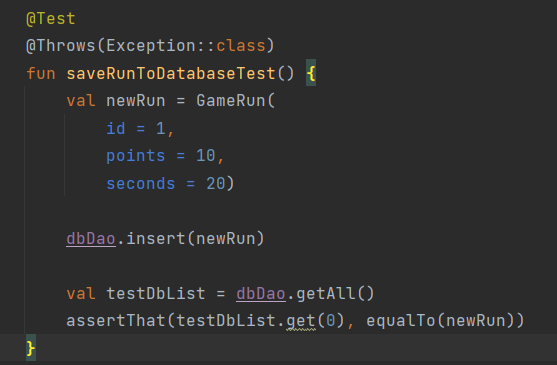
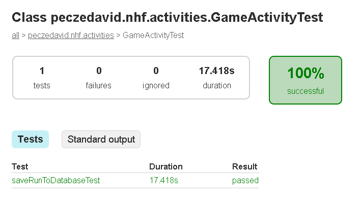

# Unit-tesztek

A unit-teszteket Android Studioban végeztük az IDE beépített tesztelési lehetőségeivel, és könyvtáraival (pl. JUnit).

## 1. Unit-teszt

`saveRunToDatabaseTest`

Egy adott játékmenet után az eredmények egy adatbázisba kerülnek mentésre. Ez a Unit-teszt a helyes mentési folyamatot kívánta ellenőrizni.

- Egy tesztadatbázis előkészítése után manuálisan hoztunk létre egy `GameRun` rekordot, amit a `GameRunDao` osztály függvényei segítségével szúrtuk be, majd kérdeztük le a tesztadatbázisból.
- A kapott eredmény valóban az általunk elmentett `GameRun` rekorddal egyezik.

